```fm
style: negative
background: true
```

## Hello _👋_

# {{process.content.frontmatter.title}}

_Creative Coding for Secret Santa_

<footer>

2023 · Zurich · Stefan Huber

</footer>

--s--

```fm
style: image
background:
  image: https://portrait.signalwerk.ch/illustration/2020/rgb/w4000/stefan-huber.jpg
  position: 50% 40%
```

## Stefan

<div class="box box--w40p box--bottom box--white box--padding small">

- Developer
- ❦ Typography

</div>

<footer class="footer--right">

Illustration by [Benjamin Güdel](http://www.guedel.biz/) · 2020

</footer>

--s--

## Secret Santa

- a _tradition_ (?) at Liip
- introduced _2020_
- my **second contribution 2021**

--s--

```fm
style: negative
background: true
```

## Why do I show it?

- Little _code project_
- Just for _fun_
- Not perfect but _«quick»_ and **dirty**

--s--

## Inspiration

- [The Public Domain Review](https://publicdomainreview.org/)
- Shows findings of cool **open/libre/free** content
- Often from [Internet Archive](https://archive.org/)

--s--

## Book about Snowflakes

- [Snowflakes: A Chapter from the Book of Nature](https://publicdomainreview.org/collection/snowflakes-a-chapter-from-the-book-of-nature-1863)
- Israel Perkins Warren
- American Tract Society, Boston, 1863

<!--
## Content

- Explorations of snowflakes
- Theories about snowflakes
- Poetry and prose excerpts
- Includes illustrations
-->

--s--

```fm
style: negative
background: true
```

## Illustrations

<div class="grid img--w100p">
<div class="col3">

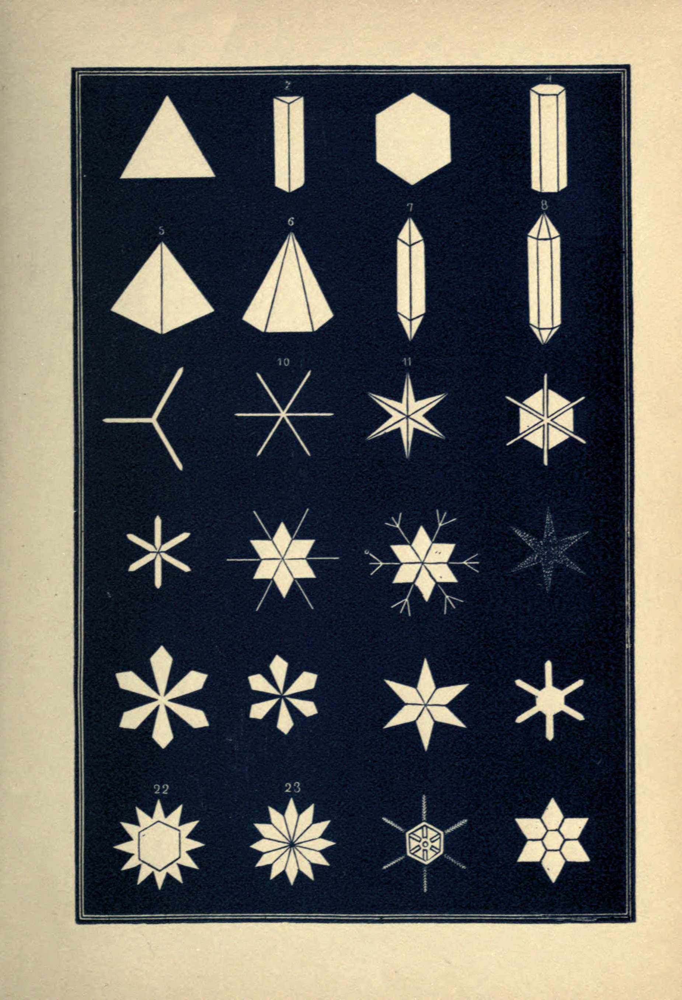

</div>
<div class="col3">

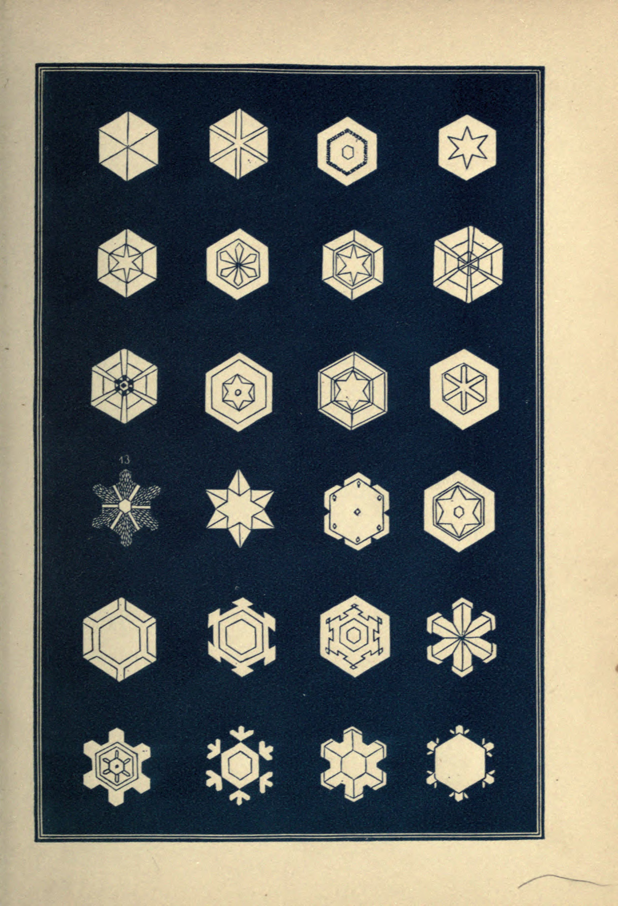

</div>
<div class="col3">

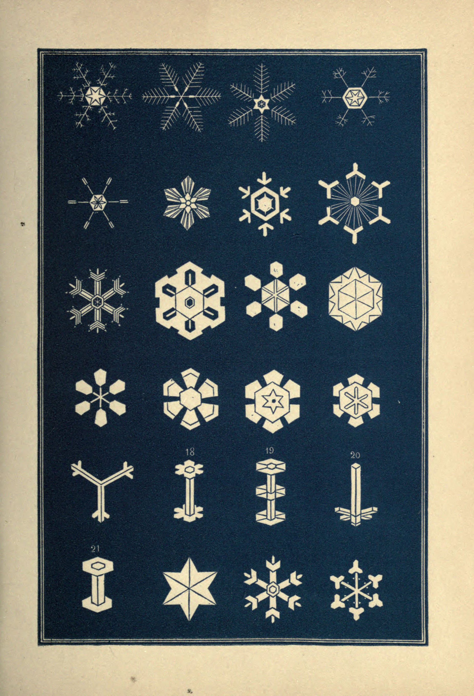

</div>
<div class="col3">

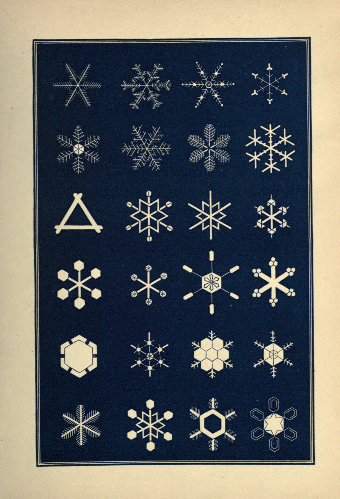

</div>
</div>

<footer>

Source: [Israel Perkins Warren, Snowflakes: A Chapter from the Book of Nature, 1863](https://archive.org/details/snowflakeschapte00warriala/)

</footer>

--s--

```fm
style: negative
background: true
```

## Illustrations

<div class="grid img--w100p">
<div class="col3">

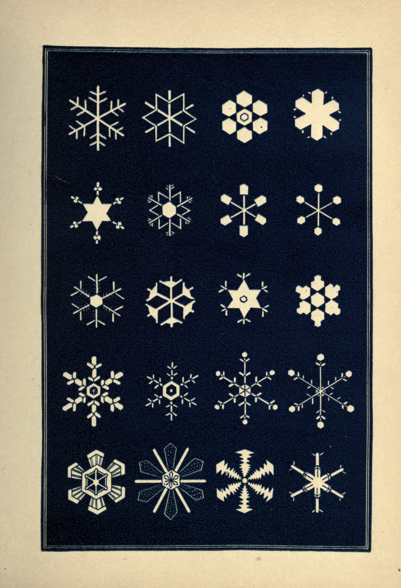

</div>
<div class="col3">

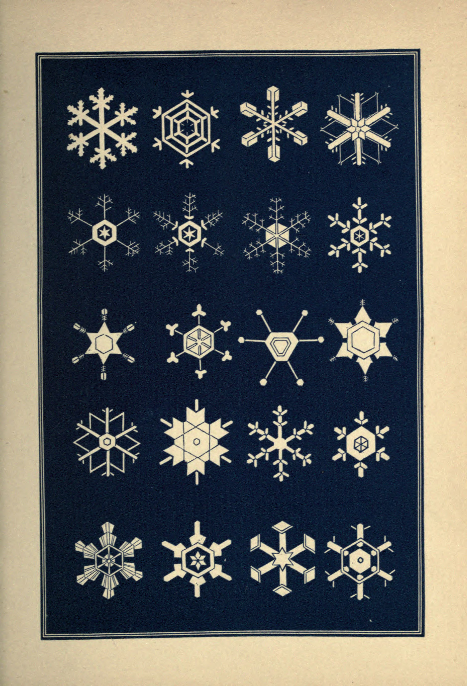

</div>
<div class="col3">

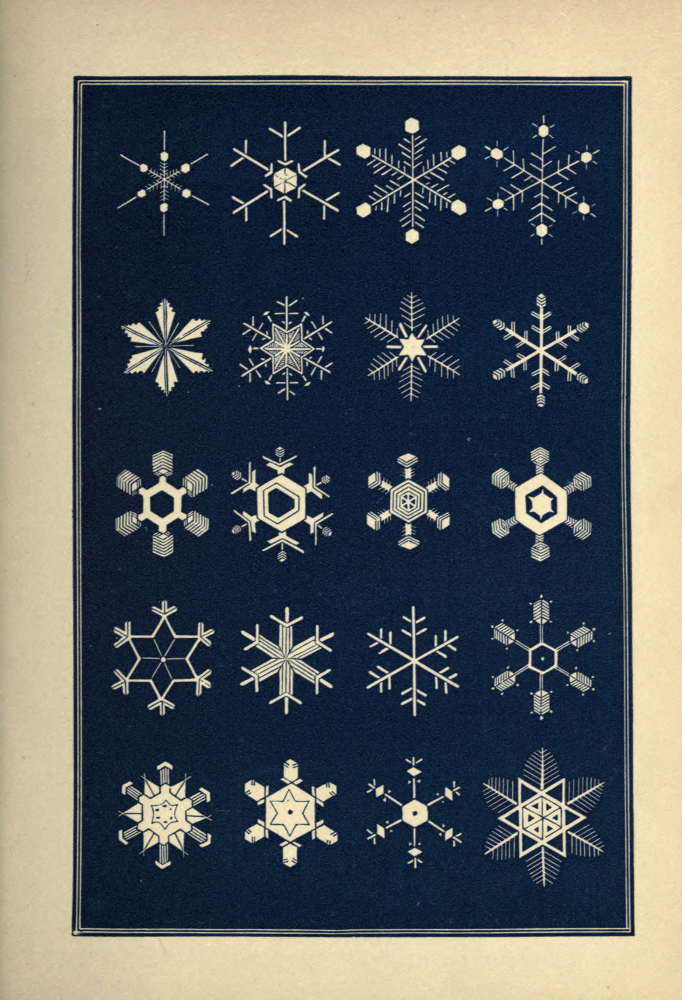

</div>
<div class="col3">

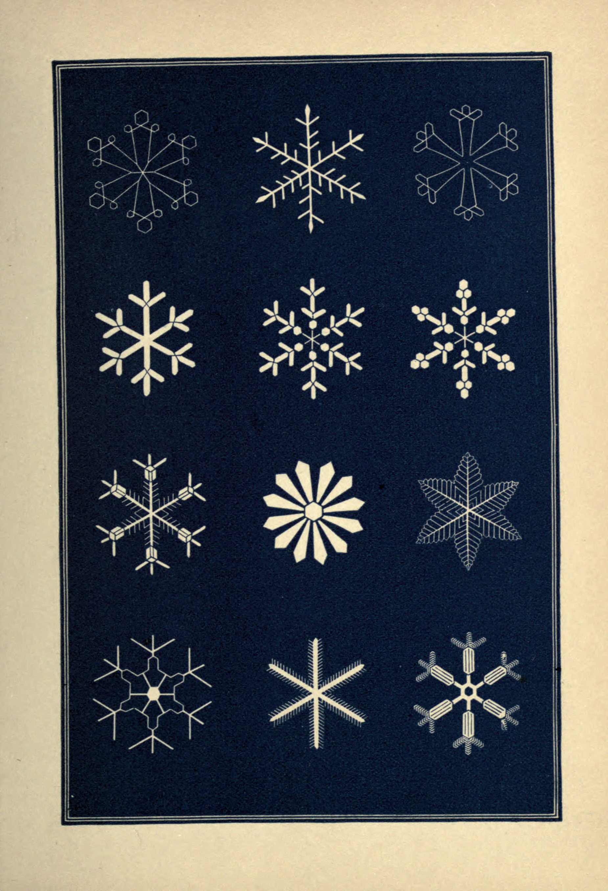

</div>
</div>

<footer>

Source: [Israel Perkins Warren, Snowflakes: A Chapter from the Book of Nature, 1863](https://archive.org/details/snowflakeschapte00warriala/)

</footer>

--s--

```fm
style: negative
background: true
```

## Illustrations

<div class="grid img--w100p">
<div class="col3">

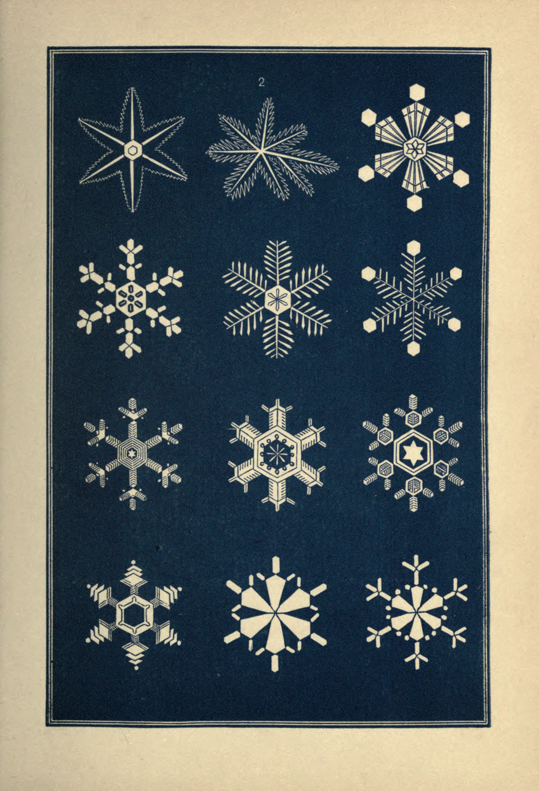

</div>
<div class="col3">

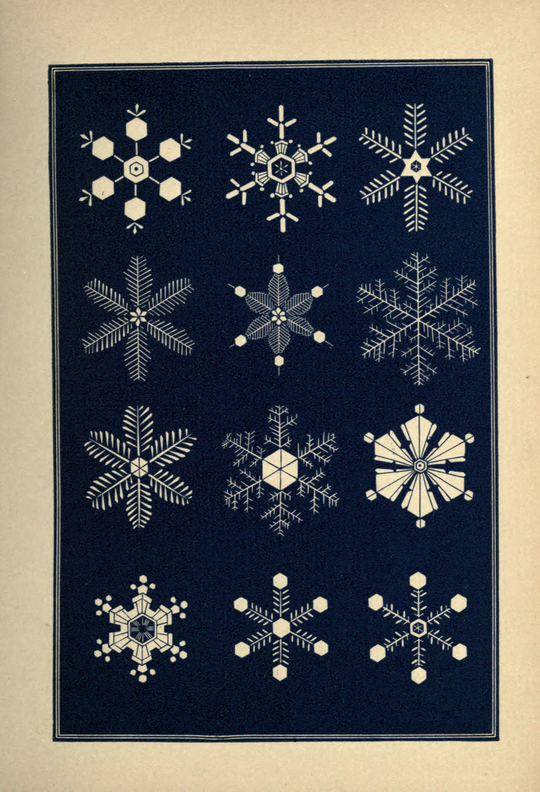

</div>
<div class="col3">

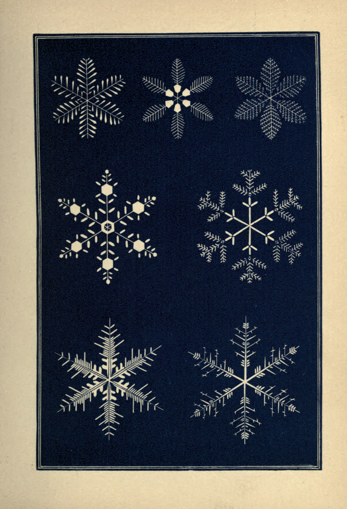

</div>
<div class="col3">

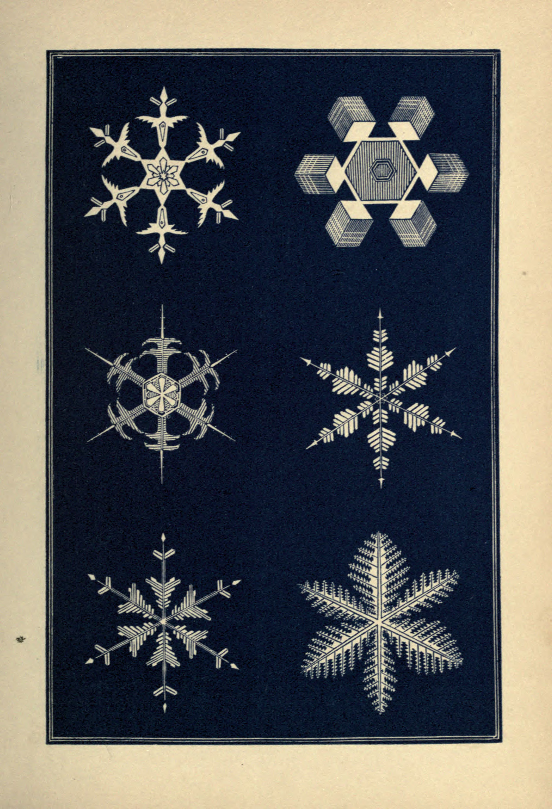

</div>
</div>

<footer>

Source: [Israel Perkins Warren, Snowflakes: A Chapter from the Book of Nature, 1863](https://archive.org/details/snowflakeschapte00warriala/)

</footer>

--s--

```fm
style: image
background:
  image: ./img/snowflakeschapte00warriala_0131.jpg
  position: 50% 42%
```

## Details

<footer class="footer--right">

Source: [Israel Perkins Warren, Snowflakes: A Chapter from the Book of Nature, 1863](https://archive.org/details/snowflakeschapte00warriala/)

</footer>

--s--

```fm
style: negative
background: true
```

## Result

- _Secret Santa_ · [Website](https://cizc9.csb.app/)
  <!-- - _Construction_ · [Website](https://snowflake.signalwerk.ch/) -->
  <!-- - _Code_ [Github](https://github.com/signalwerk/snowflake) -->

--s--

## How?

- Little **React**-Application
- Handcrafted _SVG_ elements
- Code on [Github](https://github.com/signalwerk/snowflake)

--s--

```fm
style: negative
background: true
```

## Construction

--s--

<div class="box--w100p" style="height: 100%;">
<iframe
  className="iframe--fill"
  src="https://snowflake.signalwerk.ch/">
</iframe>
</div>

<footer class="footer--right" style="text-align: right; font-size: 0.25em; opacity: .4; transform: rotate(90deg); transform-origin: bottom right;">

keypress with focus on canvas: n = new snowflake, d = debug view

</footer>

--s--

```fm
style: negative
background: true
```

## exit 0; thx

# Questions?
